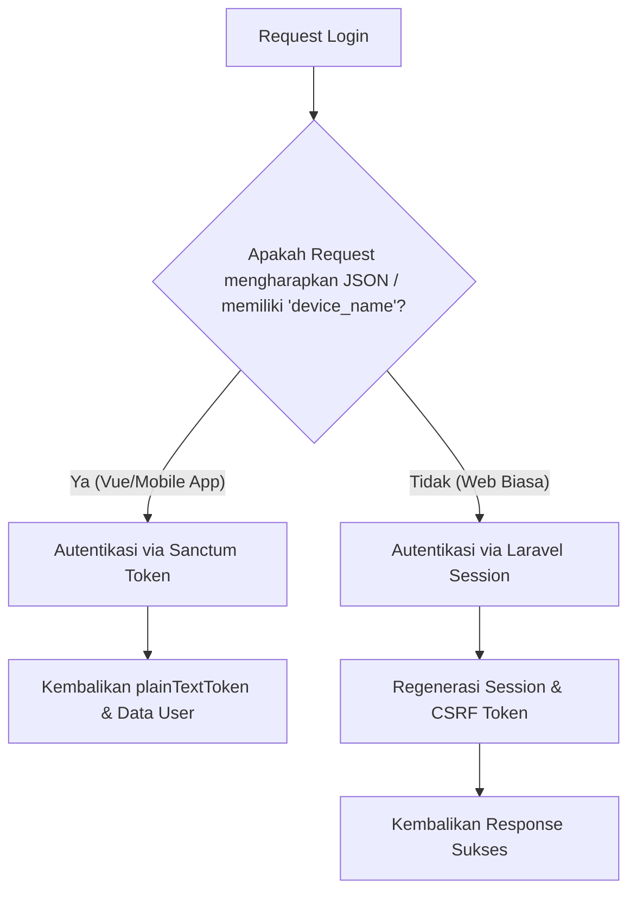
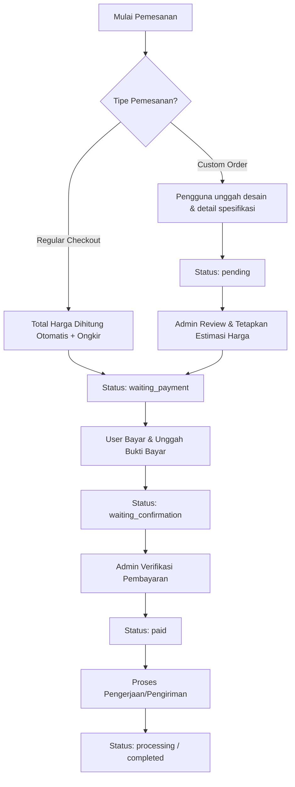

# Ambatysm Backend API 🚀

Selamat datang di repositori Backend **Ambatysm**! Repositori ini menyediakan API backend yang mendasari seluruh operasional e-commerce Ambatysm (platform penjualan pakaian/apparel), mulai dari katalog produk dinamis, variasi stok (ukuran & warna), manajemen keranjang belanja, proses pesanan reguler & *custom order*, integrasi simulasi ongkos kirim (RajaOngkir), ulasan produk, hingga dashboard statistik admin yang lengkap.

Backend ini dirancang menggunakan **Laravel 12** dengan performa tinggi, struktur basis data relasional yang dinamis, serta mekanisme *upload* gambar pintar berbasis *multi-fallback cloud hosting*.

---

## 📋 Daftar Isi
1. [Tech Stack](#-tech-stack)
2. [Fitur Utama](#-fitur-utama)
3. [Arsitektur & Alur Sistem](#-arsitektur--alur-sistem)
4. [Struktur Model & Database](#-struktur-model--database)
5. [Daftar Endpoint API](#-daftar-endpoint-api)
6. [Panduan Instalasi & Setup Lokal](#-panduan-instalasi--setup-lokal)
7. [Mekanisme Upload Gambar Pintar](#-mekanisme-upload-gambar-pintar)

---

## 🛠 Tech Stack

Berikut adalah teknologi utama yang digunakan untuk membangun backend Ambatysm:

*   **Framework Utama:** [Laravel 12.x](https://laravel.com) (PHP 8.2+)
*   **Keamanan & Autentikasi:** [Laravel Sanctum](https://laravel.com/docs/sanctum) (Mendukung *Stateful Session* untuk Web dan *Token-based* untuk Mobile/Vue Frontend)
*   **Database:** PostgreSQL (Production) / SQLite & MySQL (Development/Local)
*   **Manajer Dependensi:** [Composer](https://getcomposer.org/) & [NPM](https://www.npmjs.com/)
*   **Task Concurrency:** `npx concurrently` (Untuk menjalankan server, *queue listener*, *logs*, dan *Vite* secara bersamaan)
*   **Cloud Storage Fallback:** Integrasi API [Catbox.moe](https://catbox.moe/) & [Uguu.se](https://uguu.se/) (Untuk efisiensi penyimpanan *static files* di platform *serverless* / hosting gratis seperti Render)

---

## ✨ Fitur Utama

1.  **Sistem Autentikasi Ganda:** 
    *   Mendukung *Login* via token API (*Sanctum Plain Text Token*) untuk *Single Page Application* (Vue) / Mobile App.
    *   Mendukung *Login* tradisional berbasis *Session* untuk *server-side rendering* / web reguler.
    *   Registrasi pengguna, Pembaruan Profil (Nama, Email, Telepon, Alamat, Foto Profil).
2.  **Katalog Produk dengan Varian Stok Dinamis:**
    *   Setiap produk dapat memiliki banyak variasi stok berdasarkan **Ukuran (Size)** dan **Warna (Color)**.
    *   Total stok produk induk dihitung secara otomatis menggunakan Eloquent *booted events* saat data varian stok dibuat, diubah, atau dihapus.
    *   Dilengkapi fitur *Soft Deletes* agar produk tidak terhapus permanen jika sewaktu-waktu dibutuhkan kembali.
3.  **Manajemen Keranjang (Cart):**
    *   Pengguna dapat menambahkan produk dengan spesifikasi varian tertentu (warna & ukuran) ke keranjang.
    *   Validasi stok varian dilakukan *real-time* saat penambahan maupun *update* jumlah barang.
4.  **Checkout & Custom Order:**
    *   **Regular Order:** Pembelian produk langsung dari keranjang dengan estimasi ongkos kirim.
    *   **Custom Order:** Pembelian pakaian *custom* (desain khusus), di mana harga awal diset `0` karena memerlukan review, penentuan harga estimasi, dan persetujuan dari Admin terlebih dahulu.
    *   Konfirmasi pembayaran oleh pelanggan dengan menyertakan bukti pembayaran.
5.  **Simulasi Ongkos Kirim (Mock RajaOngkir):**
    *   Menyediakan data Provinsi dan Kota/Kabupaten seluruh Indonesia.
    *   Mengintegrasikan *Mock Shipping Cost Calculation* berdasarkan zona provinsi asal (Surabaya), berat barang (dalam gram), jenis kurir (JNE, POS, TIKI), serta status wilayah (Kota vs Kabupaten). Format respon identik dengan API resmi **RajaOngkir**.
6.  **Ulasan & Rating Produk:**
    *   Pelanggan dapat memberikan rating (1-5) beserta ulasan (komentar) setelah transaksi selesai (*completed*).
    *   Rata-rata rating (*average rating*) dan total ulasan terintegrasi langsung pada detail data produk.
7.  **Dashboard Statistik Admin & Manajemen:**
    *   Statistik pendapatan bersih, jumlah transaksi, transaksi dibatalkan, total pelanggan unik, serta total produk terjual.
    *   Data grafik penjualan harian/bulanan.
    *   Informasi 3 produk terlaris (*top selling products*).
    *   Manajemen status pesanan (*waiting confirmation*, *paid*, *processing*, *completed*, *cancelled*) dan review harga *custom order*.

---

## 🔄 Arsitektur & Alur Sistem

### 1. Autentikasi (Token vs Session)
Proses login diatur oleh [AuthController](file:///d:/Web/ambatysm/ambatysm-backend/app/Http/Controllers/AuthController.php). Flow penentuan tipe autentikasi digambarkan sebagai berikut:



### 2. Alur Pembelian & Custom Order
Pengguna dapat memilih alur reguler atau *custom*. Berikut adalah logika pemrosesan status pesanan yang dikelola oleh [OrderController](file:///d:/Web/ambatysm/ambatysm-backend/app/Http/Controllers/OrderController.php) dan [AdminOrderController](file:///d:/Web/ambatysm/ambatysm-backend/app/Http/Controllers/AdminOrderController.php):



---

## 🗄 Struktur Model & Database

Backend ini memiliki arsitektur database yang terdokumentasi dengan baik di dalam folder [migrations](file:///d:/Web/ambatysm/ambatysm-backend/database/migrations). Berikut deskripsi kelas model yang digunakan:

*   **[User](file:///d:/Web/ambatysm/ambatysm-backend/app/Models/User.php):** Menyimpan data akun pengguna. Kolom penting meliputi `role` (`admin` / `customer`), `phone`, `address`, dan `profile_picture`.
*   **[Product](file:///d:/Web/ambatysm/ambatysm-backend/app/Models/Product.php):** Menyimpan informasi dasar produk induk (Nama, Kategori, Harga, Akumulasi Total Stok, Link Gambar). Menggunakan trait `SoftDeletes`.
*   **[ProductStock](file:///d:/Web/ambatysm/ambatysm-backend/app/Models/ProductStock.php):** Menyimpan variasi ukuran (*Size*) dan warna (*Color*) beserta stok masing-masing. Berhubungan *One-to-Many* dengan `Product`. Mengatur update otomatis stok induk saat terjadi mutasi.
*   **[Cart](file:///d:/Web/ambatysm/ambatysm-backend/app/Models/Cart.php):** Menyimpan item belanjaan sementara user beserta informasi ukuran, warna, dan kuantitas terpilih.
*   **[Order](file:///d:/Web/ambatysm/ambatysm-backend/app/Models/Order.php):** Menyimpan transaksi utama. Memiliki kolom status (`waiting_payment`, `pending`, `waiting_confirmation`, `paid`, `processing`, `completed`, `cancelled`), ongkos kirim, alamat pengiriman, kurir, jenis pesanan (`regular`/`custom`), dan bukti transfer.
*   **[OrderItem](file:///d:/Web/ambatysm/ambatysm-backend/app/Models/OrderItem.php):** Detail barang yang dibeli per transaksi (menghubungkan ke produk, kuantitas, harga pada saat pembelian, serta varian ukuran/warna).
*   **[Review](file:///d:/Web/ambatysm/ambatysm-backend/app/Models/Review.php):** Menyimpan rating bintang (1-5) dan testimoni tertulis dari pelanggan pasca-transaksi.
*   **[Province](file:///d:/Web/ambatysm/ambatysm-backend/app/Models/Province.php) & [City](file:///d:/Web/ambatysm/ambatysm-backend/app/Models/City.php):** Data administratif untuk mendukung perhitungan ongkos kirim tiruan.

---

## 🛣 Daftar Endpoint API

Seluruh rute API didefinisikan dalam file [api.php](file:///d:/Web/ambatysm/ambatysm-backend/routes/api.php).

### 🌐 Rute Publik (Tanpa Autentikasi)
| Method | Endpoint | Deskripsi | Controller |
| :--- | :--- | :--- | :--- |
| `POST` | `/api/register` | Mendaftarkan pengguna baru | [AuthController@register](file:///d:/Web/ambatysm/ambatysm-backend/app/Http/Controllers/AuthController.php) |
| `POST` | `/api/login` | Autentikasi akun & mendapatkan token/session | [AuthController@login](file:///d:/Web/ambatysm/ambatysm-backend/app/Http/Controllers/AuthController.php) |
| `GET` | `/api/products` | Mendapatkan katalog produk lengkap + rating rata-rata | [ProductController@index](file:///d:/Web/ambatysm/ambatysm-backend/app/Http/Controllers/ProductController.php) |
| `GET` | `/api/products/{id}`| Detail spesifikasi produk, variasi stok, & daftar ulasan | [ProductController@show](file:///d:/Web/ambatysm/ambatysm-backend/app/Http/Controllers/ProductController.php) |

### 🔒 Rute Terproteksi (Harus Login - Semua Role)
Rute di bawah ini wajib melampirkan header `Authorization: Bearer <token_anda>` atau menggunakan *stateful session cookie*.

| Method | Endpoint | Deskripsi | Controller |
| :--- | :--- | :--- | :--- |
| `GET` | `/api/user` | Mendapatkan data informasi pengguna saat ini | [AuthController@me](file:///d:/Web/ambatysm/ambatysm-backend/app/Http/Controllers/AuthController.php) |
| `POST` | `/api/user/update` | Mengubah informasi profil dan foto profil | [AuthController@updateProfile](file:///d:/Web/ambatysm/ambatysm-backend/app/Http/Controllers/AuthController.php) |
| `POST` | `/api/logout` | Menghapus token aktif / keluar dari sistem | [AuthController@logout](file:///d:/Web/ambatysm/ambatysm-backend/app/Http/Controllers/AuthController.php) |
| `GET` | `/api/cart` | Mendapatkan semua item di keranjang belanja user | [CartController@index](file:///d:/Web/ambatysm/ambatysm-backend/app/Http/Controllers/CartController.php) |
| `POST` | `/api/cart/add` | Menambahkan item varian produk ke keranjang | [CartController@addToCart](file:///d:/Web/ambatysm/ambatysm-backend/app/Http/Controllers/CartController.php) |
| `PUT` | `/api/cart/update/{id}`| Memperbarui jumlah item dalam keranjang | [CartController@updateQuantity](file:///d:/Web/ambatysm/ambatysm-backend/app/Http/Controllers/CartController.php) |
| `DELETE`| `/api/cart/remove/{id}`| Menghapus item dari keranjang belanja | [CartController@removeFromCart](file:///d:/Web/ambatysm/ambatysm-backend/app/Http/Controllers/CartController.php) |
| `GET` | `/api/orders` | Mengambil riwayat transaksi milik user bersangkutan | [OrderController@index](file:///d:/Web/ambatysm/ambatysm-backend/app/Http/Controllers/OrderController.php) |
| `POST` | `/api/checkout` | Membuat pesanan reguler dari item di keranjang | [OrderController@checkout](file:///d:/Web/ambatysm/ambatysm-backend/app/Http/Controllers/OrderController.php) |
| `POST` | `/api/custom-order` | Mengajukan pesanan pakaian desain custom | [OrderController@customOrder](file:///d:/Web/ambatysm/ambatysm-backend/app/Http/Controllers/OrderController.php) |
| `POST` | `/api/orders/{id}/confirm-payment`| Mengunggah bukti pembayaran transaksi | [OrderController@confirmPayment](file:///d:/Web/ambatysm/ambatysm-backend/app/Http/Controllers/OrderController.php) |
| `POST` | `/api/orders/{id}/review`| Memberikan rating & komentar ulasan setelah pesanan selesai | [ReviewController@store](file:///d:/Web/ambatysm/ambatysm-backend/app/Http/Controllers/ReviewController.php) |
| `GET` | `/api/shipping/provinces`| Mengambil daftar wilayah provinsi | [ShippingController@getProvinces](file:///d:/Web/ambatysm/ambatysm-backend/app/Http/Controllers/ShippingController.php) |
| `GET` | `/api/shipping/cities`| Mengambil daftar kota (bisa difilter `province_id`) | [ShippingController@getCities](file:///d:/Web/ambatysm/ambatysm-backend/app/Http/Controllers/ShippingController.php) |
| `POST` | `/api/shipping/cost` | Simulasi perhitungan ongkir RajaOngkir (REG & YES) | [ShippingController@checkCost](file:///d:/Web/ambatysm/ambatysm-backend/app/Http/Controllers/ShippingController.php) |

### 🛠 Rute Khusus Admin (Middleware: `auth:sanctum` & `admin`)
Wajib login dengan akun yang memiliki nilai `role === 'admin'`. Diatur oleh middleware [IsAdmin](file:///d:/Web/ambatysm/ambatysm-backend/app/Http/Middleware/IsAdmin.php).

| Method | Endpoint | Deskripsi | Controller |
| :--- | :--- | :--- | :--- |
| `POST` | `/api/products` | Menambahkan produk baru beserta variannya | [ProductController@store](file:///d:/Web/ambatysm/ambatysm-backend/app/Http/Controllers/ProductController.php) |
| `PUT` | `/api/products/{id}`| Mengubah info produk & mengupdate stok varian | [ProductController@update](file:///d:/Web/ambatysm/ambatysm-backend/app/Http/Controllers/ProductController.php) |
| `DELETE`| `/api/products/{id}`| Menghapus produk dari etalase (*soft delete*) | [ProductController@destroy](file:///d:/Web/ambatysm/ambatysm-backend/app/Http/Controllers/ProductController.php) |
| `GET` | `/api/admin/orders` | Mengambil seluruh transaksi masuk secara global | [AdminOrderController@index](file:///d:/Web/ambatysm/ambatysm-backend/app/Http/Controllers/AdminOrderController.php) |
| `PATCH`| `/api/admin/orders/{id}/status`| Mengubah tahapan status transaksi | [AdminOrderController@updateStatus](file:///d:/Web/ambatysm/ambatysm-backend/app/Http/Controllers/AdminOrderController.php) |
| `PATCH`| `/api/admin/orders/{id}/custom-price`| Mengisi estimasi harga pesanan *custom* | [AdminOrderController@reviewCustomOrder](file:///d:/Web/ambatysm/ambatysm-backend/app/Http/Controllers/AdminOrderController.php) |
| `GET` | `/api/admin/dashboard-stats`| Mengambil statistik keuangan & grafik dashboard | [DashboardController@getStats](file:///d:/Web/ambatysm/ambatysm-backend/app/Http/Controllers/DashboardController.php) |

---

## 💻 Panduan Instalasi & Setup Lokal

Ikuti langkah-langkah di bawah ini untuk menjalankan server backend Ambatysm secara lokal di komputer Anda:

### 1. Prasyarat Sistem
*   **PHP** `>= 8.2` (pastikan ekstensi `pdo_sqlite`, `pdo_mysql`, atau `pdo_pgsql` aktif)
*   **Composer** (Manajer paket PHP)
*   **Node.js & NPM** (Untuk kompilasi aset & utilitas pembantu)
*   Aplikasi Database Server (MySQL / PostgreSQL / SQLite)

### 2. Kloning Repositori
```bash
git clone <url-repository-backend> ambatysm-backend
cd ambatysm-backend
```

### 3. Konfigurasi Lingkungan (`.env`)
Salin file `.env.example` menjadi `.env`:
```bash
cp .env.example .env
```
Sesuaikan konfigurasi basis data Anda pada file `.env`. Untuk kemudahan tanpa instalasi database manager, Anda dapat menggunakan SQLite:
```env
DB_CONNECTION=sqlite
```
*(Catatan: Jika menggunakan SQLite, pastikan file `database/database.sqlite` telah dibuat. Pada instalasi otomatis, Laravel akan menanyakannya atau membuatnya secara otomatis).*

### 4. Setup Sekali Langkah (One-Command Setup) ⚡
Proyek ini dilengkapi dengan skrip pintasan composer untuk mempermudah proses inisialisasi awal. Cukup jalankan perintah berikut:
```bash
composer setup
```
Perintah ini akan melakukan otomatisasi berikut secara runtut:
1. Menjalankan `composer install` untuk mengunduh semua paket dependensi PHP.
2. Membuat file `.env` jika belum ada.
3. Menghasilkan kunci aplikasi baru (`php artisan key:generate`).
4. Melakukan migrasi database (`php artisan migrate --force`).
5. Menginstal paket dependensi frontend (`npm install`).
6. Melakukan kompilasi aset produksi (`npm run build`).

### 5. Seeding Database (Mengisi Data Contoh) 📦
Untuk mempermudah pengujian, Anda bisa mengisi database dengan data dummy awal (termasuk akun administrator, daftar produk awal, data provinsi/kota, 100+ transaksi dummy historis 6 bulan terakhir untuk keperluan visualisasi chart, dan data ulasan):
```bash
php artisan db:seed
```
**Detail Akun Pengujian Default:**
*   **Akun Admin:**
    *   Email: `admin@ambatysm.com`
    *   Password: `admin123`
*   **Akun Customer Demo:**
    *   Email: `test@example.com`
    *   Password: `password123`

### 6. Menjalankan Server Pengembangan (Dev Server) 🚀
Jalankan dev server dengan perintah instan berikut:
```bash
composer dev
```
Skrip pintasan ini menggunakan `npx concurrently` untuk menjalankan 4 proses penting sekaligus secara paralel di satu terminal:
1.  `php artisan serve` - Menyediakan server lokal API (biasanya di `http://127.0.0.1:8000`).
2.  `php artisan queue:listen` - Mendengarkan pekerjaan latar belakang (*Background Job Queue Listener*).
3.  `php artisan pail` - Pemantau log error langsung ke terminal (*Real-time log stream viewer*).
4.  `npm run dev` - Menjalankan *Vite compiler* untuk memantau perubahan aset statis.

---

## 🖼 Mekanisme Upload Gambar Pintar

Salah satu fitur unik dari backend ini terdapat pada modul [ImageUploader](file:///d:/Web/ambatysm/ambatysm-backend/app/Helpers/ImageUploader.php). Untuk mengatasi keterbatasan penyimpanan *ephemeral local disk* (seperti hosting gratis di platform Render.com), sistem menggunakan **Triple Fallback Pipeline**:

```
[Unggah Gambar]
      │
      ├───► 1. Coba Unggah ke Catbox.moe (Penyimpanan Permanen Luar)
      │          │
      │          ├───► SUKSES: Kembalikan URL Catbox (Selesai)
      │          └───► GAGAL / TIMEOUT: Lanjut Langkah 2
      │
      ├───► 2. Coba Unggah ke Uguu.se (Penyimpanan Sementara 48 Jam)
      │          │
      │          ├───► SUKSES: Kembalikan URL Uguu (Selesai)
      │          └───► GAGAL: Lanjut Langkah 3
      │
      └───► 3. Cadangan Terakhir: Simpan ke Disk Lokal Publik (/storage/...)
```

Mekanisme ini menjamin proses unggah foto produk maupun bukti pembayaran tetap berjalan lancar dan efisien tanpa membebani kapasitas disk utama server backend Anda.

---

*Dikembangkan dengan penuh dedikasi oleh tim pengembang **Ambatysm**.* 😊
